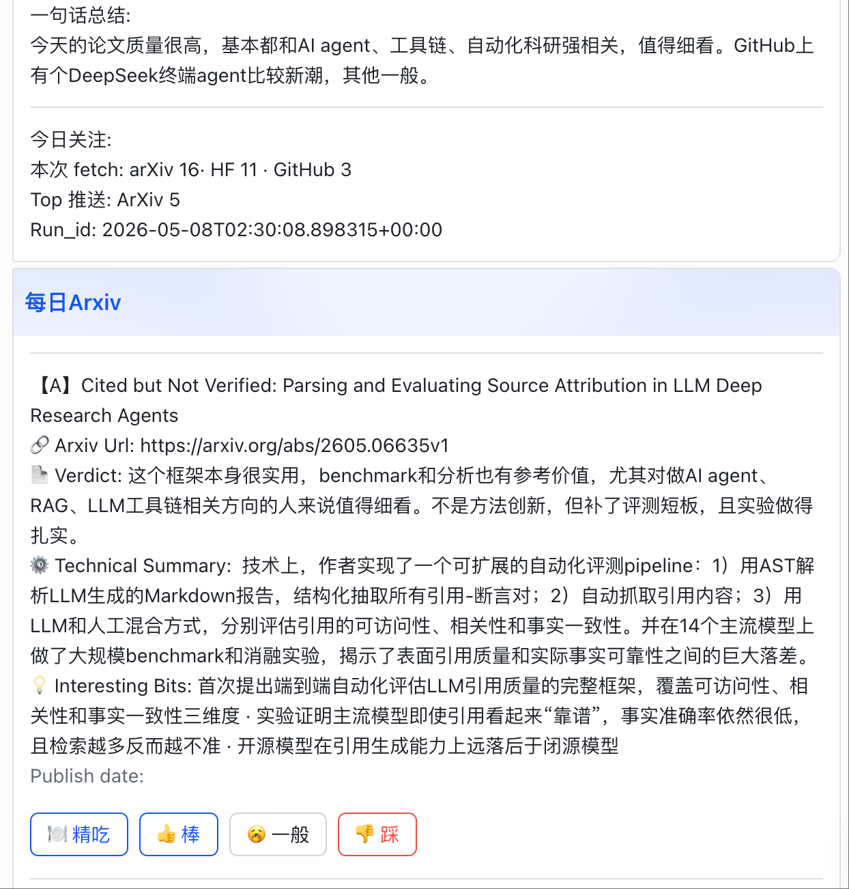

# elena-daily-paper-scout

> Daily paper scout — scans arXiv / HuggingFace / GitHub Trending, ranks with an LLM, and pushes interactive cards to Feishu (Lark) with per-paper feedback buttons.

A Feishu (Lark) bot that scans arXiv / Hugging Face Daily Papers / GitHub
Trending once a day, has an LLM judge what's worth reading, and pushes the
result as four interactive cards. Every paper card carries four buttons:

- **deep_eat** — kicks off an async deep read of that paper (PDF → analysis)
  and posts the full result back to the chat.
- **up_vote** / **normal** / **down_vote** — record an evaluation. The
  latest click for an `arxiv_id` overwrites the previous one and is stored in
  `feedback_latest.json` for later taste calibration.



For full setup instructions in Chinese (Feishu app registration, importing
the four card templates, including the `card.action.trigger` callback step,
and customizing persona / prompts / language), see **[README_CN.md](./README_CN.md)**.

## Quick start

```bash
pip install -r requirements.txt
cp .env.example .env
# fill in OPENAI_API_KEY, FEISHU_APP_ID/SECRET, FEISHU_DAILY_CHAT_ID,
# and the four FEISHU_TEMPLATE_* pairs

# run once to verify the pipeline end-to-end
./run_elena_server.sh --once

# run forever (recommended in tmux): scheduler + card.action.trigger listener
./run_elena_server.sh
```

## Customization

- **Language** — set `ELENA_LANGUAGE=en` in `.env` to load the English pack
  (`core/persona_en.py` + `core/prompts_en.py`). Default is `zh`.
- **Persona / user name / tone** — edit `core/persona_zh.py` (or `_en.py`).
- **LLM prompts** — edit `core/prompts_zh.py` (or `_en.py`). Every prompt
  used by the daily pipeline lives there.
- **Topics you want to watch** — edit `skills/daily_finder/config.json`.

## Layout

```
core/persona.py            ← dispatcher (reads ELENA_LANGUAGE)
core/persona_{zh,en}.py    ← persona / toast / card-action strings per language
core/prompts.py            ← dispatcher
core/prompts_{zh,en}.py    ← every LLM system prompt per language
core/card_actions.py       ← dispatches Feishu button clicks
skills/daily_finder/       ← daily scanning pipeline
skills/arxiv_eater/        ← fast / deep paper analysis
feishu_cards/              ← four importable .card files
scripts/                   ← chat_id grabber + per-card smoke tests
```
